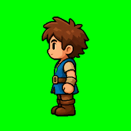
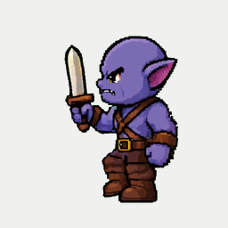

# Hero Quest Asset Pack


Build a polished fantasy platformer faster.

This pack gives you the real runtime assets from the Hero Quest build: animated
characters, platform tiles, UI, parallax backgrounds, level data, configs, and
gameplay audio, plus the key prompts used to create the art direction.

**Watch the build:** [Turning One Image Into a Playable iPhone Game - Full Tutorial](https://www.youtube.com/watch?v=GstYJ-_ZBZo&utm_source=github&utm_medium=readme_header&utm_campaign=vgd09)

**Use the cheatsheet:** [Hero Quest platformer build cheatsheet](https://link.excalidraw.com/readonly/WwXubwX0nnIl7SagZkVV?darkMode=true&utm_source=github&utm_medium=readme_header&utm_campaign=vgd09)

**Steal the prompts:** [Download the prompt recipe](prompts.pdf)

**Play the finished game:** [Hero Quest demo](https://aiod.dev/play-hero-quest?utm_source=github&utm_medium=readme_header&utm_campaign=vgd09)

## Grab The Pack

- **Hero character** with idle, walk, run, jump, punch, hurt, death, and portal
  entry spritesheets.
- **Purple orc enemy** with idle, walk, run, jump, attack, hurt, death, and
  preview animations.
- **Platformer tiles** with repeatable blocks, standalone platforms, spikes,
  coins, foliage, and portal pieces.
- **Game UI** with portrait states, health bars, coin widgets, lock icon, and
  completion icons.
- **Layered backgrounds** for parallax: far, mid, and foreground.
- **Runtime manifests** so you can see frame sizes, animation counts, asset
  names, and bounds data.
- **Playable level JSON** for the simple, medium, hard, and playground maps.
- **Music and SFX** for jumping, punching, coins, spikes, portals, enemies, UI,
  and level completion.
- **Prompt recipe** with the key user prompts for the mockup, gameplay atlas,
  UI atlas, backgrounds, hero, orc, splash screen, music, and SFX.

## Asset Previews






## Folder Map

```text
preview.gif
prompts.pdf
public/assets/
  index.json
  backgrounds/
  tiles/quest/
  ui/quest/
  hero-v2/
  enemies/purple-orc/
  audio/
  config/
  levels/
```

## Want The Full Walkthrough?

[](https://vibegamedev.com?utm_source=github&utm_medium=readme_footer&utm_campaign=vgd09)

VibeGameDev members get the build-along version of Hero Quest with the Phaser
project, starter branch, level editor, character gym, debug tools, iOS setup,
mobile controls, combat, health, pickups, and polish systems.

Join [VibeGameDev](https://vibegamedev.com?utm_source=github&utm_medium=readme_footer&utm_campaign=vgd09) to build the whole thing step by step.
