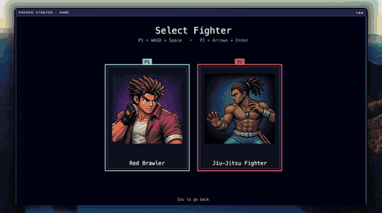
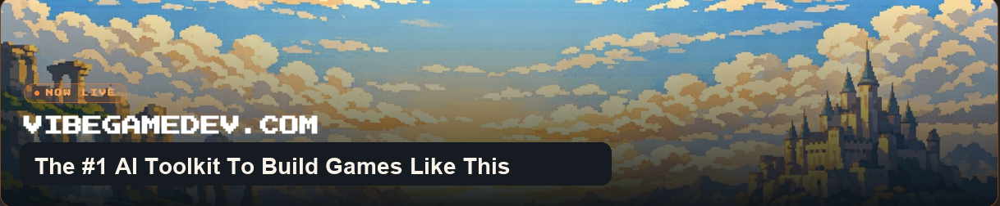

<div align="center">

# 🥊 Vibe Fighter

### A Street-Fighter-style 2D fighter — vibe-coded with AI



<br>

[](https://vibegamedev.com?utm_source=github&utm_medium=readme_badge&utm_campaign=vgd10)

**Learn to build games like this, step by step, inside [VibeGameDev](https://vibegamedev.com?utm_source=github&utm_medium=readme_badge&utm_campaign=vgd10).**

Made by [@chongdashu](https://x.com/chongdashu)

  

[▶ Watch the build](https://www.youtube.com/watch?v=en37mtF42eQ&utm_source=github&utm_medium=readme_links&utm_campaign=vgd10) · [🎮 Play the game](https://aiod.dev/play-vibe-fighter?utm_source=github&utm_medium=readme_links&utm_campaign=vgd10) · [📄 Prompt recipe](prompts.pdf) · [🚀 Full tutorial](https://vibegamedev.com?utm_source=github&utm_medium=readme_links&utm_campaign=vgd10)


</div>

---

This repo is the **complete source for the main game**: menu → mode select →
stage select → character select → the versus match, with real per-frame hitbox
combat, light and heavy attacks, geometric guard-box blocking, hitstun and
knockback, best-of-3 rounds with a timer and a group camera, a UI-atlas HUD,
and meter specials with multi-hit combos. Three AI-generated fighters — a red
brawler, a green boxer, and a jiu-jitsu fighter — on a rooftop stage.

> ### 🚀 Want the full build?
> The **developer gyms** (Character Gym, Fighter Playground, Stage Preview), the
> **build-along starter branch**, and the **complete step-by-step tutorial**
> that shows how every system was made live inside **VibeGameDev**.
>
> **→ [Build the whole thing step by step at vibegamedev.com](https://vibegamedev.com?utm_source=github&utm_medium=readme_cta&utm_campaign=vgd10)**

## Run it

```bash
npm install
npm run dev        # http://localhost:5173
npm run build      # type-check + production build to /dist
npm run typecheck
npm test
```

Two players share one keyboard (P1 + P2). The on-screen prompt shows the move
and attack keys for each player at the start of a match.

## What's inside

- **Full game flow** — splash → menu → 1v1 / 1vCPU → stage → character select →
  best-of-3 versus match → rematch or menu.
- **Real combat** — per-frame hit / hurt / **guard** boxes, light + heavy
  attacks, hitstun, knockback, and a shared rect-math so what you see is what
  hits.
- **Geometric blocking** — high/low coverage emerges from guard-box overlap, not
  height labels.
- **Rounds & camera** — first-to-2 rounds, a 60s round timer, and a group camera
  that clamps both fighters to the screen edges.
- **HUD & specials** — UI-atlas health bars and portraits with a dynamic fill, a
  meter economy, and multi-hit specials with a super cut-in.
- **Three fighters** with full action sets, portraits, and per-character config.

## What's *not* in this repo (it's in VibeGameDev)

The **developer tooling** that makes the asset pipeline practical is part of the
member build-along, not this public game build:

- 🏋️ **Character Gym** — author per-frame hit / hurt / attack / guard boxes with
  translate + scale gizmos.
- 🕹️ **Fighter Playground** — tune per-character stats live against a training
  dummy.
- 🎬 **Stage Preview** — preview and tune the parallax stage.
- 🌱 **`start` branch + full tutorial** — build the whole game from a clean
  starter, one prompt at a time.

<div align="center">

<br>

### Build games like this, step by step

[](https://vibegamedev.com?utm_source=github&utm_medium=readme_footer&utm_campaign=vgd10)

**[vibegamedev.com](https://vibegamedev.com?utm_source=github&utm_medium=readme_footer&utm_campaign=vgd10)** &nbsp;·&nbsp; follow [@chongdashu](https://x.com/chongdashu)

</div>
